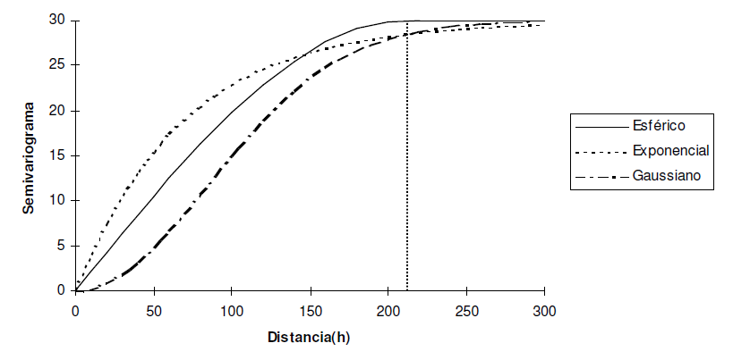

```{r setup, include=FALSE}
knitr::opts_chunk$set(echo = FALSE)
```


# Introduction to Kriging

## Basic

- Kriging is an approximation method that can give predictions of unknow values of a random functions, or random process.
- It is a linear regression model with weights into the covariance matrix.
- Kriging assumes that the closer the input data, the more positively correlated the predicton errors.
- Mathematically, this assumption is modelled through a second-order stationary covariance process:
    - The expectation of the observations are constant and do not depend on the location (the input values).
    - The covariances of the observations depend only on the "distances" between the corresponding inputs.
    - These covariances decrease with the distances between the observations.
    
## Variogram

- In Kriging, a crucial role y played by the variogram. That is a diagram of the variance of the difference bwtween the measurements at two input locations. 

- The assumption of a second-order satiationary covariance process implies that the variogram is a function of the distance h between two locations.

## Types

- There are many several types of krigin
    - Universal
    - **Ordinary**
    - Simple

## Ordinary Kriging


Suppose that measurements of the variable of interest $Z$ at the points $x_1$ of the study region are made, that is to say they have realizations of the variables $Z_1, ..., Z_n$, and if it is desired to predict $Z_0$ at the point $X_0$, where there was no measurement. In this circumstance, the ordinary Kriging method proposes that the value of the variable can be predicted as a linear combination of the n variables as:

$$
\begin{aligned}
Z^*(x_0) = \sum_{i=1}^{n} \lambda_iZ(x_i) \
\end{aligned}
$$


## Ordinary Kriging

- $\lambda_i$ are the weights of the original values.

- $\lambda_i$ weights can be estimated through the semivariogram function.

- $\lambda$ contains spatial autocorrelation.

The idea now is to determine the spatial dependence between the measured data of a variable, we can know this by means of the variogram in its effect an estimate of the variogram (semivariogram).

## Types of Semivariogram

```{r echo = FALSE, out.width = "85%"}

```

# Let's go into R

## Loading the information


```{r, eval=TRUE, echo=TRUE, message=FALSE, warning=FALSE}
library(sp)
library(gstat)
library(tidyverse)


meuse <- read_csv(file = 'data/meuse_kriging.csv')
meuse %>% 
  ggplot(aes(x, y)) +
  geom_point(aes(size=zinc), color="blue", alpha = 3/4) + 
  ggtitle("Zinc Concentration (ppm)") +
  coord_equal() + 
  theme_bw()

```

## Converting to an SPDF

To convert it to a spatial dataframe, we must first specify which of the columns contain the coordinates of the data. This is done by using R’s formula notation as follows:

```{r, eval=TRUE, echo=TRUE, message=FALSE, warning=FALSE}
coordinates(meuse) <- ~ x + y


```

Here we see that a couple of things happen when we specify the coordinates. First, the dataframe becomes an SPDF


## Fitting a variogram

To perform kriging, you must first have a variogram model, from which the data can be interpolated. There are a couple steps involved:

-  Calculate the sample variogram. This is done with the variogram function.
-  Fit a model to the sample variogram.

For example, a variogram could be fit as simply as the following code:


```{r, eval=TRUE, echo=TRUE, message=FALSE, warning=FALSE}

lzn.vgm <- variogram(zinc~1, meuse) # calculates sample variogram values 
Sph.fit <- fit.variogram(lzn.vgm, model= vgm("Sph")) # fit model
Exp.fit <- fit.variogram(lzn.vgm, model= vgm("Exp"))
Gau.fit <- fit.variogram(lzn.vgm, model= vgm("Gau"))

# plot(lzn.vgm, Sph.fit)
# plot(lzn.vgm, Exp.fit)
# plot(lzn.vgm, Gau.fit)


```

## Performing Kriging

```{r, eval=TRUE, echo=TRUE, message=FALSE, warning=FALSE}

# load spatial domain to interpolate over
meuse.grid <- read_csv("data/meuse_grid.csv")

# to compare, recall the bubble plot above; those points were what there were values for. this is much more sparse
plot1 <- meuse %>%  as.data.frame %>% 
  ggplot(aes(x, y)) + geom_point(size=1) + coord_equal() + 
  ggtitle("Points with measurements")

# this is clearly gridded over the region of interest
plot2 <- meuse.grid %>% 
  ggplot(aes(x, y)) + geom_point(size=1) + coord_equal() + 
  ggtitle("Points at which to estimate")

library(gridExtra)
grid.arrange(plot1, plot2, ncol = 2)


```

## Computation

Once we have the prepared all of the above, we are now ready to krige. This can be done with the gstat::krige function, which usually takes four arguments:

The model formula.

-  An SPDF of the spatial domain that has measurements.
-  An SPDF of the spatial domain to krige over.
-  A variogram model fitted to the data.

Note that the second and third arguments have to be SPDF’s and cannot just be dataframes.

## Fitting

```{r, eval=TRUE, echo=TRUE, message=FALSE, warning=FALSE}
coordinates(meuse.grid) <- ~ x + y # step 3 above
lzn.kriged <- krige(zinc ~ 1, meuse, meuse.grid, model=Sph.fit)

library(scales)
lzn.kriged %>% as.data.frame %>%
  ggplot(aes(x=x, y=y)) + geom_tile(aes(fill=var1.pred)) + coord_equal() +
  scale_fill_gradient(low = "yellow", high="red") +
  scale_x_continuous(labels=comma) + scale_y_continuous(labels=comma) +
  theme_bw()
```


