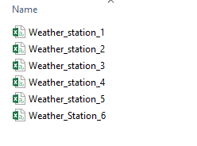

```{r setup, include=FALSE}
knitr::opts_chunk$set(echo = FALSE)
```

# Introduction

## Installing R and R-Studio

 >- Base R **<https://cran.r-project.org/mirrors.html>**
 >- RStudio **<https://www.rstudio.com/products/RStudio/>**

## What is R?

- it's a statistical software
-  it's a object base
    + Types of objects (scalar, vector, matrices, arrays and lists)
    + Assignment of objects

    
## Why use R?

>- Taken from Hadley Wickham "Fundamentally learning about the world through data is really, really good"
>- it's open source

## R as calculator

```{r, echo = TRUE}
2+4
sqrt(16)
3*(2+4)
```

## More examples

```{r, echo=FALSE, message=FALSE, warning=FALSE, results='asis'}

library(pander)
df <- read.csv(file = 'data/calculator.csv')

pandoc.table( df
              , caption = "Operation Symbols"
              , missing = NA
              , emphasize.rownames = FALSE
             )
```

>- **See <http://www.statmethods.net/management/operators.html>**

# First Steps in R

## Objects in R

>- Objects in R obtain values by assignment.  
>- This is achieved by the gets arrow, <-, and not the equal sign, =.  
>- Objects can be of different kinds. 


## Types
 
>- Primitives (numeric, integer, character, logical, factor)
>- Data Frames
>- Lists
>- Tables
>- Arrays
>- Environments
>- Others (functions, closures, promises..)

## Simple Types - Vectors 
 
The basic type unit in R is a vector
 
```{r, collapse=TRUE, echo = TRUE} 
x <- c(1,2,3)
x
x <- 1:3
x[1]
x[0]
x[-1]
```

## Generating Vectors
 
R provides lots of convenience functions for data generation:
 
```{r,collapse=TRUE, echo = TRUE}
rep(0, 5)
seq(1,10)
seq(1,2,.1)
seq(1,2,length.out=6)
```
 
## Indexing
 
```{r, collapse=TRUE, echo = TRUE, split = TRUE}
x <- c(1, 3, 4, 10, 15, 20, 50, 1, 6)
x > 10
which(x > 10)
x[x>10]
x[!x>10]
x[x<=10]
x[x>10 & x<30]
```

## Logical Operators

```{r, echo=FALSE, message=FALSE, results='asis'}

library(pander)
df <- read.csv(file = 'data/logical_operators.csv')

pandoc.table( df
              , caption = "Logical Operators"
              , missing = NA
              , emphasize.rownames = FALSE
             )
```


## Functions 
 
```{r, collapse=TRUE, echo = TRUE}
square <- function(x) x^2
square(2)
 
pow <- function(x, p=2) x^p
pow(10)
pow(10,3)
pow(p=3,10)

```

## Data Frames
 
>- Data frames are the fundamental structure used in data analysis
>- Similar to a database table in spirit (named columns, distinct types)
 
```{r, echo = TRUE}
d <- data.frame(x=1:6, y="AUDUSD", z=c("one","two"))
d
```

## Lists

```{r, echo = TRUE}
d <- data.frame(x=1:6, y="AUDUSD", z=c("one","two"))
e <- data.frame(x=1:4, y="Center", z=c("one","two"))
f <- c(1, 2, 3)

g <- list(d, e,f)
f[[3]]

```

## Installing Packages

There are some functions to make easier the management the information into R or to make a particular statistical method


```{r, eval = FALSE, echo = TRUE}
install.packages('name')
```


# World of Tidyverse

## Why use tidyverse package

```{r echo = FALSE, out.width = "85%"}
knitr::include_graphics("diagrams/data-science.png")
```

## Why use tidyverse package

>- Great for data exploration and transformation
>- Intuitive to write and easy to read, especially when using the "chaining" syntax (covered below)
Fast on data frames


## Tidy Data

See the paper Tidy Data by Hadley Wickham in Journal of Statistical Software (2014)

- Each variable forms a column
- Each observation forms a row
- Each type of observational unit forms a table


## Untidy Data

```{r, echo=FALSE, results='asis'}

library(pander)
untidy <- read.csv(file = 'data/unntidydata.csv')

pandoc.table(untidy
              , caption = "Example of common untidy data"
              , missing = NA
              , emphasize.rownames = TRUE
             )

  # extract(Type, c("variable", "year"), regex = '([:alpha:]+)([0-9]+)')
  
```

## Tidy Data

```{r, echo=FALSE, results='asis'}
library(tidyr)
library(readr)

tidy_data <- untidy %>%
  gather("Type", "Value", -Station) %>%
  separate(Type, into = c("variable", "year"))

pandoc.table(tidy_data
              , caption = "Resulting tidy data set"
              , missing = NA
              , emphasize.rownames = TRUE
             )

```

## Installing Tidyverse

```{r, eval = FALSE, echo = TRUE}
install.packages('tidyverse')
```

## Loading Packages
```{r, eval = FALSE, echo = TRUE}
library('tidyverse')
```

# Working with Tidyverse

## Selecting

```{r, eval=FALSE, echo=TRUE, message=FALSE, warning=FALSE}
library('tidyverse')

x <- read_csv(file = 'data/weather.csv')
select(x, origin, temp)
select(x, origin, humid)
select(x, year, month, day, temp)

```
 
## Filtering

```{r, eval=TRUE, echo=FALSE, message=FALSE, warning=FALSE}
library('tidyverse')

x <- read_csv(file = 'data/weather.csv')

```
 
```{r, eval=FALSE, echo=TRUE, message=FALSE, warning=FALSE}
filter(x, year == 2013)
filter(x, origin == 'EWR')
filter(x, origin == 'JFK')
filter(x, origin == 'JFK', temp >= 38, humid < 55)

```
 
## Arranging 
```{r, eval=FALSE, echo=TRUE, message=FALSE, warning=FALSE}
arrange(x, temp)
arrange(x, desc(temp))

``` 
## Mutate: Add new variables 
```{r, eval=FALSE, echo=TRUE, message=FALSE, warning=FALSE}
mutate(x, temp = (temp - 32) * 5 /9)
mutate(x, dewp = (dewp - 32) * 5 /9)
mutate(x, y = temp / dewp)
```  

## "Chaining" or "Pipelining"

>- Usual way to perform multiple operations in one line is by nesting.
>- Can write commands in a natural order by using the %>% infix operator (which can be pronounced as "then").
>- Chaining increases readability significantly when there are many commands
 
```{r, eval=FALSE, echo=TRUE, message=FALSE, warning=FALSE}

x %>%
  select(origin, temp) %>%
  filter(origin == "EWR") %>%
  mutate(temp = (temp - 32) * 5 /9)

```   
 
## Summarise: Reduce variables to values 

>- Primarily useful with data that has been grouped by one or more variables
>- group_by creates the groups that will be operated on
>- summarise uses the provided aggregation function to summarise each group 
 
```{r, eval=FALSE, echo=TRUE, message=FALSE, warning=FALSE}

x %>%
  group_by(origin) %>%
  summarise(avg_temp = mean(temp, na.rm = TRUE))


x %>%
  group_by(origin) %>%
  summarise(avg_temp = mean(temp, na.rm = TRUE), 
            avg_dewp = mean(dewp, na.rm = TRUE))

```   
## Summarise: Reduce variables to values 

```{r, eval=FALSE, echo=TRUE, message=FALSE, warning=FALSE}

x %>%
  group_by(origin, month) %>%
  summarise(avg_temp = mean(temp, na.rm = TRUE))


x %>%
  group_by(month, hour) %>%
  summarise(avg_temp = mean(temp, na.rm = TRUE), 
            avg_dewp = mean(dewp, na.rm = TRUE))

```  

# Looping

## Bonus (How to load this information?)

```{r echo = FALSE, out.width = "45%"}

```

## A bad idea

```{r, eval=FALSE, echo=TRUE, message=FALSE, warning=FALSE, tidy = TRUE}
library(tidyverse)
weather_station_1 <-  
  read_csv(file ='data/climate/Weather_station_1.csv')
weather_station_2 <- 
  read_csv(file = 'data/climate/Weather_station_2.csv')
weather_station_3 <- 
  read_csv(file = 'data/climate/Weather_station_3.csv')
weather_station_4 <- 
  read_csv(file = 'data/climate/Weather_station_4.csv')
weather_station_5 <- 
  read_csv(file = 'data/climate/Weather_station_5.csv')
weather_station_6 <- 
  read_csv(file = 'data/climate/Weather_station_6.csv')
```   

## Loops?


```{r, eval=FALSE, echo=TRUE, message=FALSE, warning = FALSE}

climate <- list()
for(i in 1:6){
  
climate[[i]] <- 
  read_csv(file = paste('data/climate/Weather_station_' , i, '.csv', sep = ''))
  
}


climate <- list.files('data/climate/', full.names = T)

climate <- lapply(climate, read_csv)

climate <- list.files('data/climate/', full.names = T) %>%
  lapply(read_csv)

```   

# Spatial data into R

## Libraries needed for the handling of spatial data

>- raster
>- rgdal
>- sf
>- sp

## Loading a Raster file

```{r, eval=TRUE, echo=TRUE, message=FALSE, warning = FALSE}

library(raster)
prec <- raster('data/raster/prec/prec1_23.tif')
plot(prec)

```  

## Croping and Masking

```{r, eval = TRUE, echo = TRUE, message = FALSE, warning = FALSE}

library(raster)
prec <- raster('data/raster/prec/prec1_23.tif')
mask <- shapefile('data/shapefile/municipios_wgs84.shp')
mask_transf <- spTransform(mask, crs(prec))

crop(prec, mask_transf)
mask(prec, mask_transf)

```  

## Loading multiple raster files

Let's GO!

## Loading multiple raster files

```{r, eval = TRUE, echo = TRUE, message = FALSE, warning = FALSE, fig.height = 3, fig.width = 3, fig.align = "center"}

library(raster)
library(tidyverse)
prec <- list.files('data/raster/prec/', full.names = T) %>%
  lapply(raster)

prec_stack <- stack(prec)

avg_prec <- mean(prec_stack)
min_prec <- min(prec_stack)
max_prec <- max(prec_stack)

plot(avg_prec)
```  
## Loading multiple raster files

```{r, eval = FALSE, echo = TRUE, message = FALSE, warning = FALSE, fig.align = "center"}

library(raster)
library(tidyverse)

prec <- list.files('data/raster/prec/', full.names = T) %>%
  stack()

tmax <- list.files('data/raster/tmax/', full.names = T) %>%
  stack()

tmin <- list.files('data/raster/tmin/', full.names = T) %>%
  stack()

```  
## Simple Features
Package sf

>- it is in the world of tidyverse
>- :)

## Working with sf

```{r, eval = FALSE, echo = TRUE, message = FALSE, warning = FALSE}


library(tidyverse)
library(sf)
library(ggplot2)
library(viridis)
prd <- st_read(dsn = 'data/shapefile/Produccion_ton.shp')

plot(st_geometry(prd))
plot(prd["AREA_OF"])

filter(prd, NOM_DEP == 'META')
filter(prd, NOM_DEP == 'META', AREA_OF >= 6000)

avg <- group_by(prd, NOM_DEP) %>%
  summarise(avg_area= mean(AREA_OF, na.rm = TRUE))

# devtools::install_github("tidyverse/ggplot2")

ggplot() +
  geom_sf(data = avg, aes(fill = avg_area)) +
  scale_fill_viridis("Area") +
  ggtitle("") +
  theme_bw()


```

